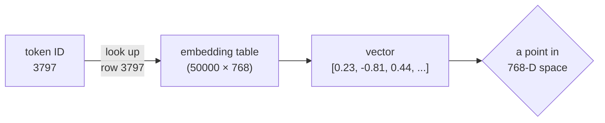

# Reverse Lesson 02 — Meaning Is Position

---

## Layer to peel: integers → vectors

We have token IDs: `[464, 3797, 3332, 319, 262, 2603]`

("the cat sat on the mat")

The model's next step: look up each ID in an **embedding table** and replace it with a vector — a list of floating-point numbers.

```
3797 ("cat")  →  [0.23, -0.81, 0.44, 0.12, -0.37, ...]
                  ↑ 768 numbers in GPT-2, up to 12288 in GPT-4
```

This step is called **embedding**. It is the step where people often think: "now the meaning goes in — now the model knows what 'cat' is."

It doesn't. Let's look at what an embedding actually is.

---

## What an embedding really is

An embedding is a **coordinate in a high-dimensional space.**

Think of it like GPS coordinates, but instead of 2 dimensions (latitude, longitude), it has 768 dimensions.

```
Location on Earth:
  Paris = (48.8566° N, 2.3522° E)      ← 2 numbers
  London = (51.5074° N, 0.1278° W)     ← 2 numbers

Word embedding:
  "cat"  = [0.23, -0.81, 0.44, ...]    ← 768 numbers
  "dog"  = [0.19, -0.77, 0.51, ...]    ← 768 numbers
```

Just like GPS coordinates don't tell you what Paris IS — they only tell you where Paris IS on a map — embeddings don't tell you what "cat" means. They only tell you where "cat" sits in a 768-dimensional mathematical space.

---

## Picture it: words are dots on a map

768 dimensions are impossible to draw. But the idea survives in 2D. Imagine flattening that giant space down to a sheet of paper. Words that appear in similar sentences land near each other:

```
   meaning-space (flattened to 2D)

   ▲
   │                          • sat
   │                        • mat        ← verbs / short words
   │
   │   • the
   │      • on                            ← function words
   │
   │                  • cat
   │                    • dog             ← animals (close together)
   │
   └───────────────────────────────────▶

   distance on this map ≈ how differently the words are used
   (NOT how different the things are in the real world)
```

`cat` and `dog` sit close. So do `sat` and `mat`. The model never decided "these are animals" or "these rhyme" — the dots simply drifted together because the words showed up in similar slots in sentences. **Nearness is a statistic, not a judgment.**



The whole "embedding" step is one table lookup. No reasoning, no definition — just *go to row 3797 and copy out 768 numbers.*

---

## Where do embeddings come from?

The embedding table is **learned during training.**

At the start: every embedding is random garbage — random numbers.

During training: the numbers are adjusted (via gradient descent) until tokens that appear in similar contexts end up near each other in the 768-dimensional space.

```
Training sees: "The cat sat" and "The dog sat" millions of times
Result: "cat" and "dog" coordinates end up close together
        because they appear in similar positions in sentences.
```

**The model didn't learn that cats and dogs are animals.** It learned that they occur in similar sentence positions. The proximity in embedding space reflects *distributional similarity*, not semantic category.

---

## The crucial test

Here is how you know embeddings don't carry meaning:

If you replaced all the words in the training data with random 6-character codes:

```
"cat" → "XQVBZM"
"dog" → "RFPKLA"
"sat" → "WNHQDS"
```

...and trained the model on the replaced text, "XQVBZM" and "RFPKLA" would end up with similar embeddings, because they appear in similar sentence positions.

The model would behave identically. It would generate XQVBZM instead of cat, but the "intelligence" would be the same.

**The words are labels. The meaning you attach to them lives in your head, not in the model.**

---

## What vectors can do (and can't do)

Embeddings have a famous property: **vector arithmetic correlates with semantic relationships**.

```
embedding("king") - embedding("man") + embedding("woman")
≈ embedding("queen")
```

This looks like the model understands royalty, gender, and political hierarchy.

What actually happened: words that appear in similar contexts get similar vectors. "King" and "queen" appear in similar contexts, "king" and "man" appear in similar contexts — and the vector differences happen to align.

It is a **geometric accident of co-occurrence**, not a stored fact about the world.

The model has no entry that says: `king = male monarch`. It has a coordinate, and that coordinate's position relative to other coordinates forms a pattern that we interpret as meaning.

<details>
<summary><b>🔬 Go deeper — how "closeness" is actually measured</b> (optional, more technical)</summary>

When we say two embeddings are "close," we almost never mean straight-line (Euclidean) distance. We mean the **angle** between them, measured with **cosine similarity**:

```
                a · b              (dot product)
cos(θ) = ─────────────────
          |a| × |b|          (product of lengths)
```

- `+1.0` → vectors point the same direction (used almost identically)
- ` 0.0` → perpendicular (unrelated usage)
- `-1.0` → opposite directions

Why angle instead of distance? Because a word that simply appears *more often* gets a longer vector, and we don't want raw frequency to dominate "similarity." Normalizing by length (`|a|`, `|b|`) cancels that out, leaving only *direction* — which is what carries the co-occurrence pattern.

And the famous `king - man + woman ≈ queen`? That's vector subtraction finding a direction. `king - man` is roughly the vector that points "toward royalty, away from male-ness." Add it to `woman` and you land near `queen`. It works only because those four words happened to sit in that geometric arrangement after training — and it breaks constantly for less common words. It is a measurable tendency, not a reasoning engine.

</details>

---

## Embeddings are just the starting point

After tokenization, each token ID becomes a vector. That vector is then:

1. Added to a positional encoding (to signal order)
2. Passed through attention layers
3. Passed through feed-forward layers
4. Eventually mapped to output probabilities

At every step: **numbers going in, numbers coming out.**

The embedding table is not a dictionary. It is a lookup table of coordinates. Nothing more.

---

## The state so far

```
WHAT YOU SEE               WHAT'S ACTUALLY THERE
────────────────────       ─────────────────────────────────
Words with meaning     →   Integers (token IDs)
             ↓
Integers with meaning  →   Coordinate vectors (768 floats)
```

We now have vectors. But vectors are just arrays of numbers. Still no understanding.

---

## Run the demo

See [demo.ts](demo.ts) — creates a tiny embedding table (random, like a freshly initialized model), shows how token IDs become vectors, and demonstrates that those vectors have no inherent meaning. It also **draws an ASCII map** of where each word lands and a bar chart of their similarities, so you can see the clustering instead of just reading about it.

> **🔬 Try this:** open `demo.ts` and change `dog`'s vector to be far from `cat` (e.g. `[-0.9, 0.8, 0.1, -0.6]`). Re-run it. The similarity drops and the map moves the dot — proving the "meaning" lives entirely in the numbers you chose, nowhere else.

---

## Next

[RL-03 → Attention Is Arithmetic](../RL-03-attention-is-arithmetic/lesson.md)

The vectors now flow through the most famous part of the transformer: the attention mechanism. This is where people say "the model understands relationships between words." Let's look at what actually happens.
