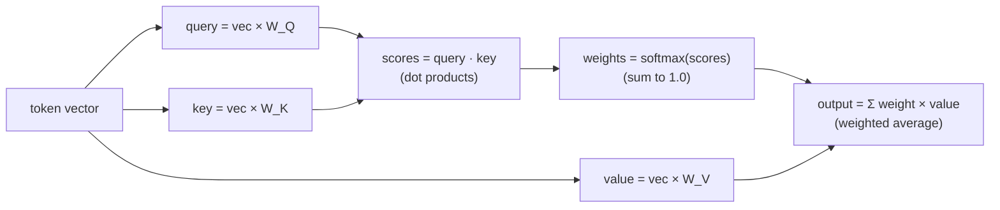

# Reverse Lesson 03 — Attention Is Arithmetic

---

## Layer to peel: relationships → dot products

We have a sequence of vectors, one per token.

```
"The cat sat on the mat"
  ↓
[v_the, v_cat, v_sat, v_on, v_the, v_mat]
  each v is a vector of 768 numbers
```

Now the **attention mechanism** runs. This is the heart of the transformer. The name "attention" sounds like the model is paying attention to meaning — understanding which words relate to which.

It isn't.

---

## The whole mechanism in one picture

Before the math, here is every step attention takes for a single token. Follow the arrows — there are only four operations, and all of them are arithmetic:



That's the entire engine. Three multiplications to make Q/K/V, a pile of dot products, one softmax, one weighted sum. Let's walk each box.

---

## What attention does: one sentence

Consider: `"The animal didn't cross the street because it was too tired."`

What does "it" refer to? "The animal" — not "the street."

A human reading this knows:
- Animals get tired
- Streets don't get tired
- Therefore "it" = "the animal"

A transformer handles "it" using attention. But here is what attention actually computes:

---

## The three matrices: Q, K, V

Each token vector gets multiplied by three learned weight matrices:

```
query  = token_vector × W_Q      (what am I looking for?)
key    = token_vector × W_K      (what do I offer?)
value  = token_vector × W_V      (what information do I carry?)
```

These are just matrix multiplications — standard linear algebra. Numbers in, numbers out.

Then: for every token, compute how much it should "attend to" every other token:

```
attention_score(i, j) = dot_product(query_i, key_j)
                        ÷ sqrt(dimension)
```

A dot product is just: multiply corresponding numbers, add them up.

```
query_i = [0.3, -0.2, 0.8, 0.1]
key_j   = [0.5,  0.4, 0.7, 0.2]

dot product = (0.3)(0.5) + (-0.2)(0.4) + (0.8)(0.7) + (0.1)(0.2)
            = 0.15 - 0.08 + 0.56 + 0.02
            = 0.65
```

One number. That's the "attention score" between token i and token j.

---

## Softmax to get attention weights

The scores get passed through softmax to become probabilities (attention weights):

```
scores  = [0.65, 0.20, 0.80, 0.10]   ← raw dot products
weights = softmax(scores)
        = [0.25, 0.15, 0.45, 0.10]   ← sum to 1.0
```

The token with the highest score gets the most "attention."

---

## Combining with values

Finally, the output for each token is a **weighted sum of value vectors**:

```
output_i = sum(weight_j × value_j)  for all j

         = 0.25 × value_0
         + 0.15 × value_1
         + 0.45 × value_2      ← this token gets most weight
         + 0.10 × value_3
```

This is the output of one attention head for token i: a weighted average of other tokens' value vectors.

No understanding. Just weighted averages.

---

## Seeing it: the attention grid

Run those dot products for every pair of tokens and you get a grid — a row per token doing the "looking," a column per token being "looked at." Each cell is one softmax weight; darker = more attention. This is the trained pattern for our `"it"` sentence:

```
            attends to →
            animal  street   it    tired
          ┌──────────────────────────────┐
  animal  │  ███     ░       ░      ░     │
  street  │  ░       ███     ░      ░     │
  it      │  ███     ░       ░      ██    │   ← "it" lights up on "animal", not "street"
  tired   │  █       ░       ░      ███   │
          └──────────────────────────────┘
            ███ high   ██ medium   ░ near zero
```

The row for `it` is the whole trick: a high weight on `animal`, a low weight on `street`. It looks like the model *resolved a pronoun*. What actually produced that row was `query_it · key_animal` coming out larger than `query_it · key_street` — one number beating another number. **The grid is a picture of arithmetic, not comprehension.**

---

## Back to "it"

So how does the model correctly resolve "it" = "the animal"?

During training, the weights in W_Q, W_K, W_V were adjusted via gradient descent until "it" queries that key-matched "animal" better than "street" — because in millions of sentences with "it was tired," the surrounding context words were more animal-like than street-like.

The model doesn't know animals get tired and streets don't. It learned that the vectors for "animal" and "tired" tend to co-occur in patterns where "it" also appears. The query-key dot products for those vectors happen to be higher.

**Grammar is geometry. Understanding is statistics.**

<details>
<summary><b>🔬 Go deeper — three details the one-head picture skips</b> (optional, more technical)</summary>

**1. Why divide by `√dimension`?**
Dot products grow with the number of dimensions you sum over. In a 64-dim head, raw scores can swing into the tens or hundreds. Feed those into softmax and it saturates — one weight becomes ~1.0 and the rest ~0.0, so gradients vanish and training stalls. Dividing by `√d` keeps the scores in a sane range. It's numerical hygiene, not intelligence.

**2. One head is never enough — multi-head attention.**
Real models run many attention heads *in parallel* (12 in GPT-2, 96 in GPT-3), each with its own `W_Q/W_K/W_V`. One head might track subject–verb links, another nearby word order, another long-range references. Their outputs are concatenated and mixed by another matrix. Still no understanding — just *more* dot products, learned to specialize.

```
        ┌─ head 1 ─┐
input ──┼─ head 2 ─┼── concat ── × W_O ── output
        ├─ head 3 ─┤
        └─  ...   ─┘
```

**3. Causal masking — the model can't see the future.**
When generating text left-to-right, token *i* is only allowed to attend to tokens *≤ i*. This is enforced by setting the disallowed scores to `-∞` **before** softmax, so their weights become exactly 0. That single masking step is the entire difference between "fill in the blank" (BERT-style) and "continue the text" (GPT-style) attention.

</details>

---

## What attention can and cannot do

Attention CAN:
- Route information from one token position to another
- Weight tokens differently based on learned vector geometry
- Build up complex representations through many layers of attention

Attention CANNOT:
- Look up facts from a knowledge base
- Check if a statement is true
- Reason step by step (without special training)
- Know what words mean outside of their co-occurrence patterns

---

## The state so far

```
WHAT YOU SEE                    WHAT'S ACTUALLY THERE
────────────────────────────    ─────────────────────────────────
"Understanding relationships"   Dot products between vectors
"Knowing which words connect"   Softmax over dot product scores
"Following reference (it)"      Weighted sum of value vectors
```

Three operations. All arithmetic.

---

## Run the demo

See [demo.ts](demo.ts) — implements full single-head attention from scratch, shows every step as explicit numbers, and **prints the attention grid as an ASCII heatmap** so you can watch which token attends to which. The output is purely a weighted average — no language knowledge involved.

> **🔬 Try this:** in `demo.ts`, swap two rows of `W_Q` (or zero one out) and re-run. The heatmap reorganizes completely. Nothing about the *words* changed — only the numbers in a weight matrix — yet the "attention" is now totally different. That's the proof that the pattern lives in the matrices, not in any understanding of the sentence.

---

## Next

[RL-04 → Prediction, Not Knowing](../RL-04-prediction-not-knowing/lesson.md)

After many attention layers and feed-forward layers, the model produces logits. This is where people say "the model knows the answer." It doesn't. It predicts the most probable next token.
